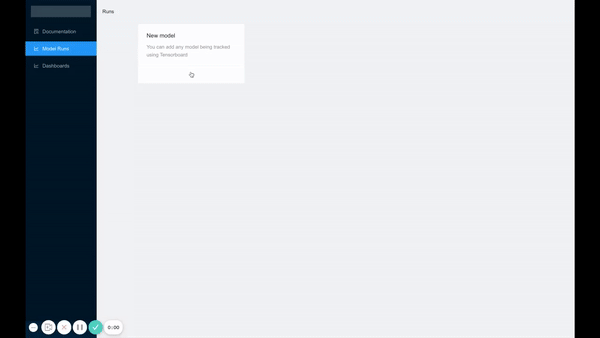

<div align="center">

# TensorBoard Projects


**Management UI for Tensorboard Dashboards**

[](https://img.shields.io/github/license/jverre/tensorboard-projects)


</div>

---

TensorBoard is a powerful visualization tool when building machine learning models. However it can quickly become quite unwieldy as the number of model versions and runs increases.


## What is TensorBoard Projects
TensorBoard Projects provides a UI to manage Tensorboard runs and allows you to easily:
* Visualize runs for a given model
* Archive Runs
* Delete Runs
* Add metadata to individual runss
* Start TensorBoard dashboard for a subset of model runs
* Write documentation for a model

As the project is still very much in development, please report any issues or features you would like to see added !



## What TensorBoard Projects isn't
**TensorBoard projects is not an experiment tracking solution**, it simply allows you to better manage TensorBoard runs.

If you are looking for a fully fledgeed experiment tracking solution, you can look into:
* [ClearML](https://www.clear.ml/)
* [Comet](https://www.comet.ml/site/)
* [MLFlow](https://www.mlflow.org/)
* [Weights and Biases](https://wandb.ai/site)
and others

## Using TensorBoard Projects
Tensorboard Projects can be installed from PyPI using `pip install tensorboard-projects`.

Once Tensorboard Projects is installed, you can start the UI using:
```
tensorboard-projects ui --port 5000 --host 0.0.0.0
```
